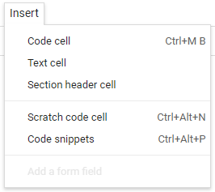

# Projeto: 0

[](https://www.python.org/)
[](https://pandas.pydata.org/)
[](https://jupyter.org/)

[← Voltar](../README.md)

## Sumário

- [Objetivo](#objetivo)
- [Instruções](#instruções)
  - [Dados](#dados)
  - [Projeto](#projeto)
- [Como Submeter o Projeto](#como-submeter-o-projeto)
- [Ajuda](#ajuda)
- [Contatos](#contatos)

## Objetivo
Iniciar o aprendizado do pandas e do jupyter notebooks (Google Colab).

## Instruções

Para as instruções abaixo:
 - `[Md]`: indica que a célula usada é do tipo **texto**/**markdown**
 - `[Code]`: indica que a célula usada é do tipo **código**

 

### Dados

1. Acessar o site do [UCI Machine Learning Repository](https://archive.ics.uci.edu/ml/datasets.php) e procurar pelo conjunto de dados chamado **Breast Cancer Wisconsin**;
2. Clicar em `Data Folder` e realizar o download do arquivo; `breast-cancer-wisconsin.data` (que contém o conjunto de dados a ser estudado) e `breast-cancer-wisconsin.names` (que contém informações sobre o conjunto de dados).

### Projeto

#### Parte I

1. Criar uma pasta chamada `IFCE_ICA_SEUNOME` no diretório raiz do seu Google Drive, substituindo `SEUNOME`;
   1. Criar uma subpasta chamada `Projeto 0`;
   2. Fazer o upload do arquivo `.data` e `.names` para o a pasta do projeto;
   3. Criar um novo projeto do tipo Google Colab intitulado **projeto-0-`SEUNOME`**. 
       - [Clique aqui para obter ajuda!](#ajuda)


#### Parte II

No Google Colab:

1. `[Md]`: Colar o código abaixo, substituindo `SEUNOME`:

```md
# Projeto: 0
 - Autor: SEUMOME
 - Turma: XXXX.X

## Objetivo
Iniciar o aprendizado do pandas e do jupyter notebooks (Google Colab)

## Dados
Descrição dos dados

## Colunas
 - Coluna 1
 - Coluna 2
```

2. Na seção `## Dados` da célula acima, descreva os dados com um parágrafo curto:
   - Procure esta informação no arquivo `.names`. 

3. Na seção `## Colunas` da célula cima, liste as colunas dos dados:
   - Procure na seção Attributes do arquivo `.names`.

[Clique aqui para obter ajuda!](#ajuda)

#### Parte III

1. `[Code]`: Criar e executar a célula abaixo, realizando o `import` das bibliotecas `numpy` e `pandas` e montando o drive do Google:

```py
# Bibliotecas
import numpy as np
import pandas as pd

''' 
Na primeira vez que você executar esta parte do código, 
uma caixa de texto e um link devem aparecer na tela. 
Clique no link e siga até encontrar o código que você 
deve colar na caixa de texto. 
'''

# Google Drive
from google.colab import drive
drive.mount('/content/drive', force_remount=True)
```

2. `[Code]`: Criar a célula e ajustar os valores das variáveis abaixo:
    - Substituia `SEUNOME` e `NUMERODOPROJETO`
    - Execute a célula

```py
# Caminho do arquivo
arquivo = '/content/drive/My Drive/IFCE_IAC_SEUNOME/Projeto NUMERODOPROJETO/breast-cancer-wisconsin.data'

# Nome das Colunas
nomes = ['id', 'thickness', 'size', 'shape', 'adh', 'epsize', 'barenuclei', 'chromatin', 'nucleoli', 'mitoses', 'class']
```

3. `[Code]`: Criar e executar a célula abaixo, realizando a leitura do arquivo `.data` por meio do `pandas` em uma variável chamada `df`:

```py
# Leitura dos dados
df = pd.read_csv(arquivo, names=nomes)
```

#### Parte IV

Pesquise na internet e crie uma nova célula `[Code]` para cada uma das tarefas a seguir.

1. Exibir o número de linhas e colunas dos dados;
2. Exibir a lista de colunas;
3. Exibir os tipos das colunas:
   - Verificar se alguma coluna que deveria ser de tipo numérico está com outro tipo diferente;
   - Comente no código qual, se existir, uma ou mais coluna com o tipo diferente.
 4. Usar o método `describe()` nos dados e explicar, de maneira geral, `[Md]` que informações a função apresenta;
 5. Exibir a média dos valores das colunas;
 6. Exibir as 10 primeiras linhas do conjunto de dados.

> Observe o exemplo abaixo de como criar cada bloco.

```py
# Exibir as 10 primeiras linhas do conjunto de dados
df.head(10)
```

## Como submeter o Projeto
1. Procure o botão `Compartilhar` no Google Colab e escolha `copiar link`;
2. Envie o link na tarefa do Google Salada de Aula, relacionada ao projeto.

 > **Atenção**: Execute todas as células antes de enviar o link

## Ajuda
 - [Google Colab para Iniciantes](https://medium.com/machina-sapiens/google-colab-guia-do-iniciante-334d70aad531)
 - [Markdown para Iniciantes](https://produtive.me/guia/markdown-um-guia-para-iniciantes/)
 - [Uma Introdução Simples ao Pandas](https://medium.com/data-hackers/uma-introdu%C3%A7%C3%A3o-simples-ao-pandas-1e15eea37fa1)

## Contatos
Em caso de dúvidas procure contato via:
 - Google Sala de Aula
 - Email Institucional

[↑ Topo](#projeto-0)